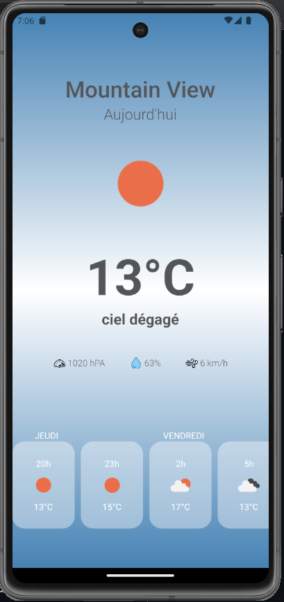
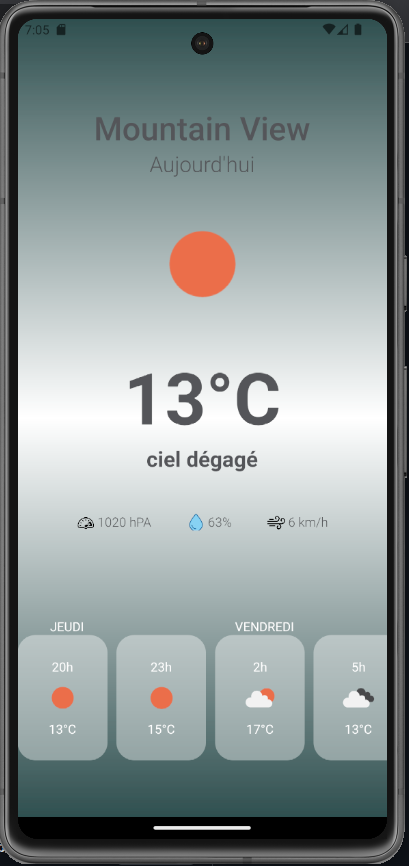

# Meteo-App
<p align="center">
  
   
</p>

**`First install package`**

```
$ yarn install
```

**`Run android`**

```
$ yarn android
```
**`Run ios`**

```
$ yarn ios
```
**`Run web`**

```
$ yarn web
```

<i align="center">Add your <b>API KEY</b> from https://openweathermap.org/ in <b>api/api.js</b></i>
